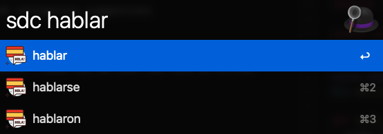

# SpanishDict Alfred Workflow

main.rb currently provides two options, translation suggestions and conjugation suggestions

## :translation_suggestion

this provides an interface for retrieving suggestions from spanishdict. These can be then fed into an Alfred action to open the resulting webpage.

## :conjugation_suggestion

this is slightly smarter, and filters the results of the suggestions by if the resulting conjugation page exists.

As such, it is much slower than translate.rb as it's making web requests for every result (minus results with spaces in them as a rudimentary filter against sentence results).

Note: There's a slight unexpected behavior where it will return english verbs, as SpanishDict's URL scheme is smart™ enough to translate the word before showing conjugation tables.

## caching

This workflow implement a pretty dumb cache that expires after a week.

## Usage

`sd WORD OR SENTENCE` opens a suggestion window where the action is opening to spanishdict.com with that word or phrase.

`sdc word` opens a suggestion window for verbs where the action is to open to the conjugation table on spanishdict.com

